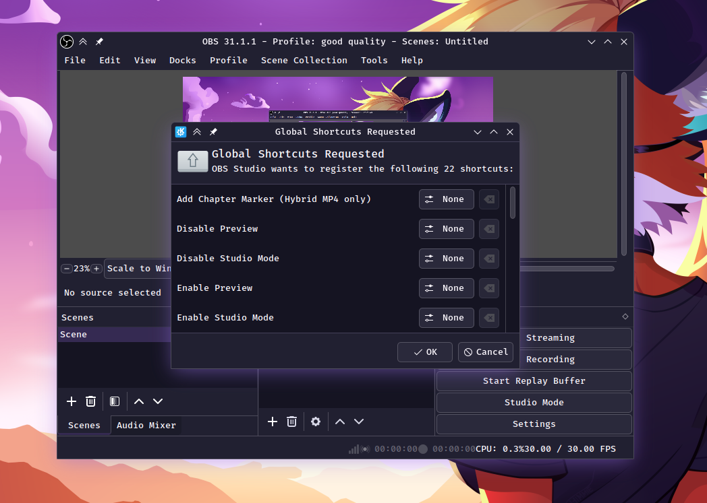
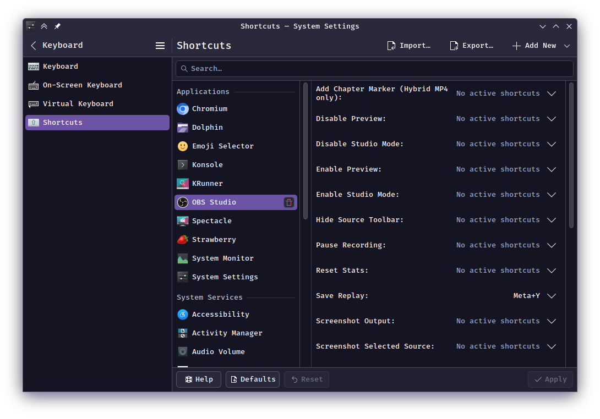

# OBS Wayland Hotkeys

An OBS Studio plugin to integrate OBS hotkeys with the [Wayland Global Shortcuts Portal](https://flatpak.github.io/xdg-desktop-portal/docs/doc-org.freedesktop.portal.GlobalShortcuts.html).

This allows you to use push-to-talk, scene switching, and other hotkeys while OBS is in the background on Wayland sessions (where traditional hotkeys often fail).




## Table of Contents
1. [Installation](#installation)
2. [First Time Setup](#first-time-setup)
3. [Configuring Shortcuts](#configuring-shortcuts)
4. [System Settings Locations](#system-settings-locations)
    - [Ubuntu / GNOME](#ubuntu--gnome)
    - [KDE Plasma](#kde-plasma)
5. [Updating or Adding New Shortcuts](#updating-or-adding-new-shortcuts-important)
6. [Build Instructions](#build-instructions)

---

## Installation

### Flatpak (Recommended)
This plugin is available in the official OBS Studio Flatpak Add-ons list.
1. Open your software manager or terminal.
2. Install the **OBS Studio** Flatpak.
3. Look for **OBS Wayland Hotkeys** in the add-ons/extensions list and install it.

### Manual Build
See [Build Instructions](#build-instructions) at the bottom if you are compiling from source.

---

## First Time Setup

When you launch OBS Studio for the first time after installing this plugin:

1. A system window titled **Add Keyboard Shortcuts** will appear.
2. This window lists all available OBS actions (like "Toggle Recording" or "Switch to Scene").
3. You can click on actions here to assign your keys immediately.
4. Click **Add** to finish setup.

**Important:**
- This system **replaces** the standard OBS Hotkeys menu for these actions.
- The keys you set here are managed by your Operating System, not OBS.
- It does not import your existing hotkeys from OBS; you must set them up in this new dialog.

*Note: If you do not see this dialog, ensure you are running a Wayland session and have a compatible desktop environment (GNOME 49+, KDE Plasma 6+, etc).*

---

## Configuring Shortcuts

Once the initial setup is complete, **OBS no longer manages these keys**.

To change, add, or remove key bindings, you must go to your **Operating System's Settings** (e.g., GNOME Settings or KDE System Settings). The standard "Hotkeys" menu inside OBS will not work for these actions.

See the [System Settings Locations](#system-settings-locations) section below for exactly where to find these settings on your computer.

### The "Tools" Menu (Optional Shortcut)
Inside OBS, there is a helper button that attempts to open these settings for you:
1. Go to the **Tools** menu at the top of OBS.
2. Select **Configure Wayland Hotkeys**.

*Note: This menu item may not be available on all systems. Additionally, on some desktop environments, clicking it may do nothing if the system does not support the configuration request. If this button doesn't work, simply open your System Settings manually as described below.*

---

## System Settings Locations

To change which keys trigger your actions manually:

### Ubuntu / GNOME
*Tested on Ubuntu 25.10 (GNOME 49)*

1. Open system **Settings**.
2. Navigate to **Apps** -> **OBS Studio**.
3. Click on **Global Shortcuts**.
4. You will see the list of actions. Click them to assign keys.
5. To reset (see below), scroll to the very bottom to find **Remove All Shortcuts**.

### KDE Plasma
*Tested on Arch Linux with Plasma 6.5*

1. Open **System Settings**.
2. Navigate to **Keyboard** -> **Shortcuts**.
3. Select **OBS Studio** from the list.

---

## Updating or Adding New Shortcuts (Important)

The Wayland Portal handles shortcuts in "Sessions". How updates are handled depends on the version of the portal your system uses.

### Understanding Portal Versions

The **Global Shortcuts Portal** is the system component that manages these hotkeys. It has two main versions:

*   **Version 1:** The initial implementation found in most current Linux distributions (e.g., Ubuntu 24.04/25.04, Fedora 40). Once an application registers shortcuts, the system "locks" that list. If you add a new scene in OBS, the system won't see it automatically.
*   **Version 2:** A newer standard that supports dynamic updates. If your system supports this, new shortcuts might appear automatically without needing a reset.

### The Issue (Common on Version 1)

If you add a new Scene in OBS, or if a new feature is added to this plugin, the new shortcut might not appear in your System Settings immediately because the Operating System "remembers" the old list of shortcuts from the previous session.

### How to Fix (Resetting the Session)

If you are missing shortcuts (like a newly created Scene) in your system settings:

1. **Close OBS.**
2. Go to your System Settings location (as described above).
3. **Remove the shortcuts.**
   - **Ubuntu/GNOME:** Scroll to the very bottom of the Global Shortcuts list and click the **Remove All Shortcuts** button.
   - **KDE:** Uncheck or remove the entry for OBS.
4. **Open OBS.**
5. The **Add Keyboard Shortcuts** dialog will appear again.
6. Click **Add**. The list in your System Settings will now be updated with all current scenes and actions.

---

## Build Instructions

### Building for Flatpak (Recommended)

If you use the Flatpak version of OBS Studio, you **must** build the plugin inside the Flatpak environment. This ensures the plugin uses the exact same version of Qt and dependencies as OBS itself.

**Prerequisites:**
- `flatpak` installed.
- `com.obsproject.Studio` installed.

#### 1. Install the SDK
First, check which runtime OBS Studio is using with `flatpak info com.obsproject.Studio`. Then, install the matching SDK. For example, if OBS uses `org.kde.Platform/x86_64/6.7`, you would install `org.kde.Platform.Sdk/x86_64/6.7`.

```bash
flatpak info com.obsproject.Studio # Check runtime, e.g., org.kde.Platform/x86_64/6.7
flatpak install org.kde.Platform.Sdk/x86_64/6.7 # Replace with your detected runtime and version
```

#### 2. Enter the Flatpak Build Environment
Access the Flatpak development shell for OBS Studio. This ensures all dependencies (like Qt) match the OBS Flatpak runtime.

```bash
flatpak run --command=bash --devel com.obsproject.Studio
```

#### 3. Navigate to Source Directory
Inside the Flatpak shell, navigate to the directory where you cloned or extracted this plugin's source code. The host file system is typically mounted under `/run/host`.

```bash
cd /run/host/path/to/your/obs-wayland-hotkeys
```

#### 4. Configure, Build, and Install
Once you are in the plugin's source directory within the Flatpak shell, execute the following commands.
*   We use the `Ninja` generator for faster builds.
*   `CMAKE_INSTALL_PREFIX` is set to `/app`, which is the root of the Flatpak runtime.
*   `CMAKE_INSTALL_RPATH` is set to `/app/lib` to ensure the plugin can correctly locate `libobs-frontend-api.so.0` and other OBS shared libraries within the Flatpak environment.
*   `rm -rf build` ensures a clean build, especially important if you previously encountered issues with dependency mismatches.

```bash
# Delete existing build directory to ensure a clean build
rm -rf build

# Configure CMake
cmake -G Ninja -DCMAKE_INSTALL_PREFIX=/app -DCMAKE_INSTALL_RPATH=/app/lib -B build .

# Build the plugin
ninja -C build

# Install the plugin to the correct Flatpak location: /app/lib/obs-plugins/
cp build/obs-wayland-hotkeys.so ~/.var/app/com.obsproject.Studio/config/obs-studio/plugins/obs-wayland-hotkeys/bin/64bit/
```
